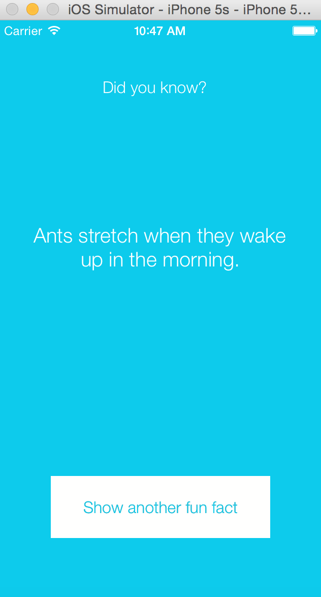

# Fun Facts
Fun facts is an iphone native app built in Swift with Xcode. It uses the MVC design pattern. This was my first project in Swift which I built to get an understanding of the basics of the Swift language and how to work with Xcode.

Fun facts displays a random fact from a selection of 10 that are hardcoded into the app. When the 'Show another fun fact' button is pressed, another fact is displayed, and the background colour and button text colour change to a random colour.

I enjoyed working in Swift as the syntax is quite similar to Javascript! The main difficuty I faced was the not being able to find an easy way to test it. For that reason I choose not to test it as I wanted this exercise to be most about learning the basics of the language.

##Screenshots
<div align="center">
  
</div>

##Technology
- Swift
- Xcode

##To Run
You must have Xcode installed
```
$ git clone https://github.com/katebeavis/fun-facts-swift.git
$ cd fun-facts-swift
Open Xcode and click on the 'play' button to start the ios simulator
```
